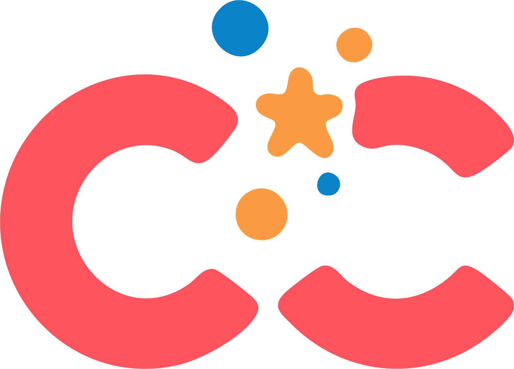

# CliniCrush: Find your perfect match.

<div align="center">
  
  <br />
  <strong>🏆 First Place Winner – Biotech/Healthcare, HackDKU 2025</strong>  
  <br /><br />
  
</div>

---

## 🧠 Overview

Finding a clinical trial shouldn't feel like solving a puzzle. **CliniCrush** is a gamified, swipe-based web application prototype that helps patients match with clinical trials tailored to their medical profile. Inspired by the familiarity of dating apps, we make discovering trials intuitive, personalized, and even fun.

Built for **HackDKU 2025** in the **Biotech/Healthcare** track, **CliniCrush won 1st place**, recognized for its innovative approach to trial discovery and potential to improve access to life-changing medical research.

---

## 💡 Key Features

- 🎯 **Personalized Matching**: Users input medical conditions, age, gender, location, and preferences.
- 👉 **Tinder-Style Swiping**: Swipe right on trials you’re interested in; left to pass.
- 📍 **Location-Aware Discovery**: Prioritizes nearby trials with geocoding and distance calculation.
- 📋 **Rich Trial Info**: View eligibility, compensation, and content details.
- 🎉 **Match Celebration**: Visual feedback for successful matches.
- 💾 **Local Match Storage**: Saves matched trials for future reference.

---

## 🔍 Matching Algorithm

Our custom ranking system assigns a match score based on:

- ✅ Condition Relevance — 50 points  
- 🚻 Gender Eligibility — 15 points  
- 🎂 Age Eligibility — 15 points  
- 📍 Proximity to User — 20 points  
- 💰 Compensation Offered — 10 points  

This ensures users see the most relevant trials first.

---

## 💻 Tech Stack

### Frontend
- **React 19** + **TypeScript**
- **React Bootstrap 2.10.9**
- **React Context API** for state

### Backend
- **Flask 2.2.3** with Python
- **ClinicalTrials.gov API v2** for real-time trial data
- **Google Maps API** for geocoding and distance metrics
- **Flask-CORS** for cross-origin support

---

## 🚀 Getting Started

### Prerequisites
- Node.js (v14+)
- Python 3.8+
- Google Maps API key (for geolocation features)

### Frontend Setup
```bash
cd frontend
npm install
cp .env.example .env  # Then edit if needed
npm start
```

### Backend Setup
```bash
cd backend
pip install -r requirements.txt
cp .env.example .env  # Then edit if needed
python app.py
```

Frontend runs at [http://localhost:3000](http://localhost:3000)  
Backend runs at [http://localhost:2000](http://localhost:2000)

---

## 🏆 Hackathon Journey

**CliniCrush** was conceived and built in under 24 hours at **HackDKU 2025**, where it took home **First Place in the Biotech/Healthcare category**.

Key challenges tackled:

- 🧭 Real-time distance calculations  
- 🔄 Normalizing inconsistent trial data  
- 🧪 Designing a medical-friendly UX for non-experts  
- 🧠 Balancing user input against complex eligibility criteria  

---

## 📈 What’s Next

- 📝 In-app trial enrollment  
- 💬 Direct messaging with coordinators  
- ⏰ Appointment reminders  
- 📖 Enhanced health profiles, with scannable QR system to share medical details with providers  
- 🔗 Optimized matching algorithm  

---

## 👥 Who It's For

- Patients seeking alternatives to standard treatment  
- People with rare or difficult-to-treat conditions  
- Caregivers and healthcare providers  
- Anyone curious about contributing to medical progress  

---

## 📞 Contact

- Maintainers:  
  - [Ooha Lakkadi Reddy](https://github.com/oohalakkadi)

> *CliniCrush: Swipe right for the future.*  